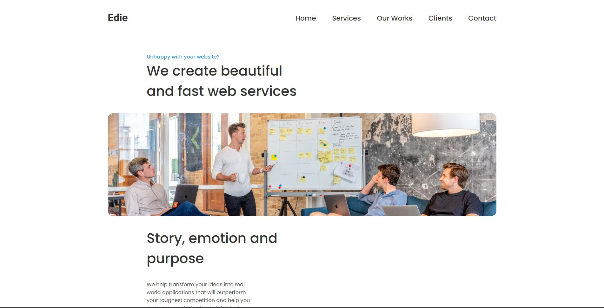

<!-- Please update value in the {}  -->

<h1 align="center">Edie - Vue.js</h1>

<div align="center">
   Solution for a challenge from  <a href="http://devchallenges.io" target="_blank">Devchallenges.io</a>.
</div>

<div align="center">
  <h3>
    <a href="https://edie-jade.vercel.app/">
      Demo
    </a>
    <span> | </span>
    <a href="https://devchallenges.io/solutions/ekj7xuJGU6lKZS4V6bWH">
      Solution
    </a>
    <span> | </span>
    <a href="https://devchallenges.io/challenges/xobQBuf8zWWmiYMIAZe0">
      Challenge
    </a>
  </h3>
</div>

<!-- TABLE OF CONTENTS -->

## Table of Contents

- [Overview](#overview)
  - [Built With](#built-with)
- [Features](#features)
- [How to use](#how-to-use)
- [Contact](#contact)
- [Acknowledgements](#acknowledgements)

<!-- OVERVIEW -->

## Overview



### Built With

<!-- This section should list any major frameworks that you built your project using. Here are a few examples.-->

- [Vue.js](https://vuejs.org/)
- [SCSS](https://sass-lang.com/)
- [router-vue](https://router.vuejs.org/)

## How To Use

<!-- Example: -->

To clone and run this application, you'll need [Git](https://git-scm.com) and [Node.js](https://nodejs.org/en/download/) (which comes with [npm](http://npmjs.com)) installed on your computer. From your command line:

```bash
# Clone this repository
$ git clone https://github.com/your-user-name/your-project-name

# Install dependencies
$ npm install

# Run the app
$ npm start
```

## Acknowledgements

<!-- This section should list any articles or add-ons/plugins that helps you to complete the project. This is optional but it will help you in the future. For example -->

- [Vue.js](https://vuejs.org/)
- [SCSS](https://sass-lang.com/)
- [Vue Observable](https://regenrek.com/posts/how-to-create-an-animated-vue-sidebar-menu-with-vue-observable/#demo)
- [vue-router](https://codesandbox.io/s/vuerouter-4-anchor-links-vc73l?file=/src/router.js)

## Contact

- Website [robin-minster.fr](https://robin-minster.fr/)
- GitHub [@MinsterRobin](https://github.com/MinsterRobin)
